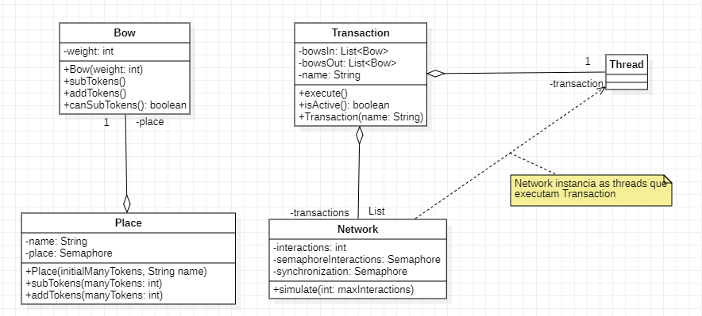
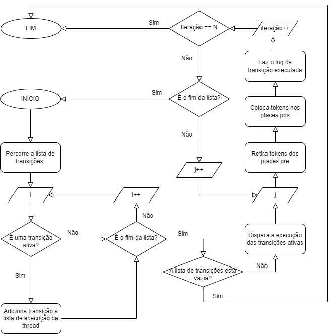

# PetriDinner - Petri Network

Implementação de um motor de simulação de rede de petri. \
Implementation of a petri net simulation engine.

## Authors

- [Andrigo Borba dos Santos](https://github.com/andrigoBS)
- [Karoline de Souza Guckert](https://github.com/karolineguckert)

## Dependencies:

- java 19

## Modeling

